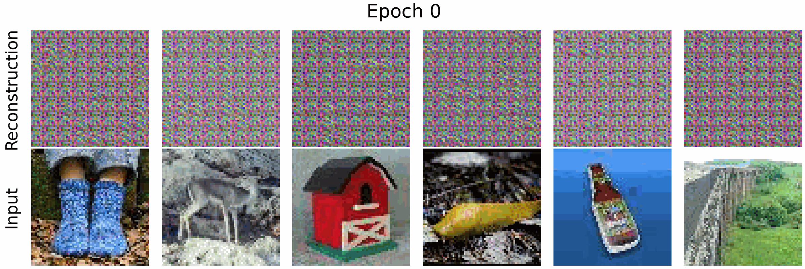

# Masked Auto Encoders (MAE) from scatch 
From scratch implementation of the paper: "[Masked Autoencoders Are Scalable Vision Learners](https://arxiv.org/abs/2111.06377)" CVPR 2022

### Clone and install dependencies
``` 
git clone https://github.com/aldipiroli/mae_from_scratch
pip install -r requirements.txt
``` 
### Train 
``` 
cd python 
python train.py
```
Note: the script will download the [TinyImageNet dataset](http://cs231n.stanford.edu/tiny-imagenet-200.zip) automatically.

### Reconstruction Examples

